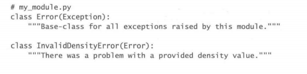

# C4

## 29 用纯属性取代get和set方法

如果想实现类似前面两种方法的安全赋值/取值版本方法，可以使用**@property修饰器和setter方法**。前者实现了安全访问，后者被调用时会调用被装饰器装饰的变量同名方法，里面会执行很多语句，起到了替代原有**set方法**的作用。

*<u>@property的最大缺点在于：和属性相关的方法，只能在子类里面共享，而与之无关的其他类，则无法复用同一份实现代码。不过，Python也提供了描述符机制(参见本书第31条)，开发者可以通过它来复用与属性有关的逻辑，此外，描述符还有其他一些用法。</u>*（没太理解）

不要在里面做多余的事情，做传统意义上该做的事就好。@property方法需要执行得迅速一些。

**不过这种方法不便于复用，哪怕两个属性对应函数的行为完全相同，也要写两套函数**

## 30 考虑用@property来代替属性重构

@property还有一种 高级的用法，就是可以把简单的数值属性迁移为实时计算(on-the-fly calculation,按 需计算、动态计算)的属性。

***<u>说到底还是实现定义访问对象的某个属性时，需要表现出特殊的行为吧</u>***

*<u>在处理实际工作中的代码时，@property固然是一项非常有效的工具，但是也不能滥用。如果你发现自己正在不停地编写各种@property方法，那恐怕就意味着当前这个类的代码写得确实很差。此时，应该彻底重构该类，而不应该继续修补这套糟糕的设计。</u>*

## 31 用描述符来改写需要复用的@property方法

**`__get__`和`__set__`说明对象遵从描述符协议。**

看原文档比较好

# C5

# C6

## 42 用functools.wraps定义函数修饰器

用@符号来修饰函数，其效果就等于先以该函数为参数，调用修饰器，然后把 修饰器所返回的结果，赋给同一个作用域中与原函数同名的那个变量。

这个机制下的副作用是会把修饰器内部的相应函数传递给模块中的同名变量。

functools.wraps可以解决这一问题，他可以把与内部函数相关的重要元数据全部复制到外围函数。

对于调试器这种依靠内省机制的工具，直接编写修饰器会引发奇怪的行为。修饰器还可能导致一些难以排查的问题。

## 43 考虑以contextlib和with语句来改写复用的try/finally 代码

【**应该看书再看看**】

## 45 用datetime模块来处理本地时间，而不是用time模块

【**应该看书再看看，或者用的时候再看看**】

## 46 使用内置算法与数据结构

数据结构集中于`collections`模块。`heapq`模块提供与堆相关的函数，可在list类型中创建堆。`bisect`提供了二分查找。

1. **双向队列**`collections.deque`

   在头部或尾部插入/删除一个元素只消耗常数级别时间，适合**先进先出**。在list的头部插入元素需要线性级别的时间。

2. **有序字典**`collections.OrderedDict`

   标准字典是无序的，在拥有相同键值对的两个dict上面迭代，可能会出现不同的迭代顺序。这是因为其快速哈希表决定的。

3. **带有默认值的字典**`collections.defaultdict`

    

   具体暂略，上面代码能实现计数器功能。***我记得好像是有专门的计数器结构的，是迭代器库那个我记混了？***

4. **堆队列(优先级队列)**`heapq`

   这里只介绍了`heappush`，它使list中可以存在堆结构，甚至在调用sort后依然可以保持。

5. **二分查找**

   `bisect.bisect_left`提供二分查找方法，返回搜寻值的插入点（搜寻的值不一定在序列中）。

## 47 在重视精确度的场合，应该使用decimal

# C7

## 50 用包来安排模块，并提供稳固的API

只要目录里有`__init__.py`,我们就可以采用相对于该目录的路径，来引入目录中的其他Python文件。

包所提供的能力，主要有两大用途。

## 名称空间

包的第一种用途，是把模块划分到不同的名称空间之中。这使得开发者可以编写多个文件名相同的模块，并把它们放在不同的绝对路径之下。

*<u>如果包内方法同名，则可以通过`as`语句给引入当前作用域的属性重新起名。</u>*

## 稳固的API

Python包的第二种用途，是为外部使用者提供严谨而稳固的API。我们必须把代码的内部结构对外隐藏起来，以便在不影响现有用户的前提下，通过重构来改善包内的模块。

在Python程序中，我们可以为包或模块编写名为`__all__`的特殊属性，以减少其曝露给外围API使用者的信息量。`__all__`属性的值，是一份列表，其中的每个名称，都将作为本模块的一条公共API，导出给外部代码。**<u>如果外部用户以`from foo import *`的形式来使用foo模块，那么只有`foo.__all__`中列出的那些属性，若是foo模块没有提供`__all__`,则只会引人public属性（不以双下划线开头的）。</u>**

 

 

这样只要重写`__init__`，API的使用者就可以直接从包名引入方法，而不需要访问包中具体的函数名称。

避免使用`import *`，同名覆盖的问题不得不注意

 

## 51 为自编的模块定义根异常，以便将调用者与API相隔离

</u>

在模块中编写一种根异常，然后令该模块所抛出的异常都继承自这个根异常。

 

首先，通过捕获根异常，调用者可以得知他们在使用你的API时，所编写的调用代码是否正确。如果调用者以合理的方式来使用这套API，那么他们应该会捕获该模块所抛出的各种异常。若是某种异常没有得到处理，那么该异常就会传播到try/except语句中负责处理模块根异常的那个except块里面，而那个except块，则会把该异常告知API的使用者，提醒他们应该为这种类型的异常添加适当的处理逻辑。

使用根异常的第二个好处，是可以帮助模块的开发者找寻API里的bug。

使用根异常的第三个好处，是便于API的后续演化。将来我们可能会在AM里面提供更为具体的异常，以便在特定的情况下抛出。

