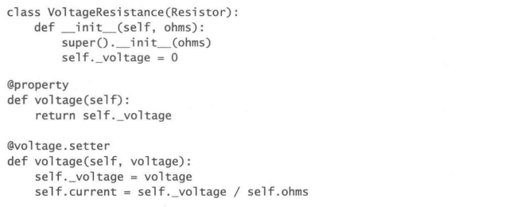
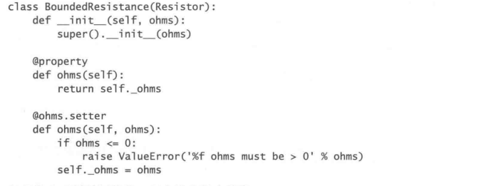
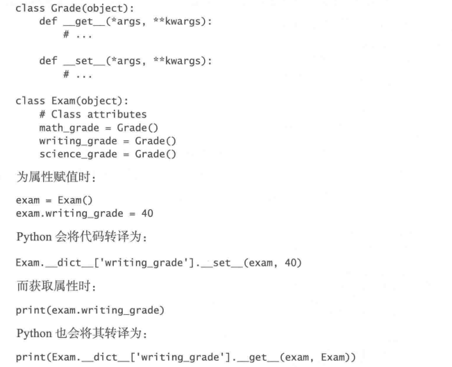
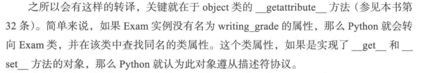
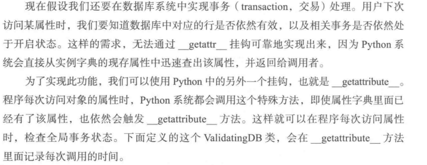
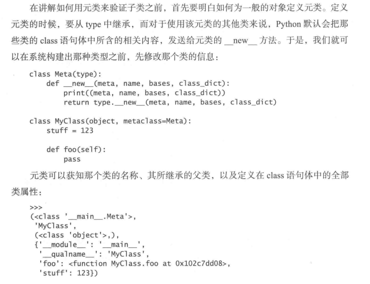

# 摘要

**metaclass** （元类）这个词，只是模糊地描述了一种髙于类，而又超乎类的概念。简单来说，就是我们可以把Python的class语句转译为元类，并令其在每次定义具体的类时， 都提供独特的行为。

Python可以动态地定义对属性的访问操作。


# 第29条：用纯属性取代get和set方法

一般在类中配置getXXX和setXXX方法是很常见的，但是在Python中很少这么做。

如果想实现类似前面两种方法的安全赋值/取值版本方法，可以使用**@property修饰器和setter方法**。前者实现了安全访问，后者被调用时会调用被装饰器装饰的变量同名方法，里面会执行很多语句，起到了替代原有**set方法**的作用。

**<u>这两个装饰器可以实现：定义访问对象的某个属性时，需要表现出特殊的行为</u>**


例如：

 

下面这个例子里，这种方法可以保护属性不被更改。
 

*<u>@property的最大缺点在于：和属性相关的方法，只能在子类里面共享，而与之无关的其他类，则无法复用同一份实现代码。不过，Python也提供了描述符机制(参见本书第31条)，开发者可以通过它来复用与属性有关的逻辑，此外，描述符还有其他一些用法。</u>*（没太理解）


不要在里面做多余的事情，做传统意义上该做的事就好。@property方法需要执行得迅速一些。


# 第30条：考虑用@property来代替属性重构

@property还有一种 高级的用法，就是可以把简单的数值属性迁移为实时计算(on-the-fly calculation,按 需计算、动态计算)的属性。

***<u>说到底还是实现定义访问对象的某个属性时，需要表现出特殊的行为吧</u>***


*<u>在处理实际工作中的代码时，@property固然是一项非常有效的工具，但是也不能滥用。如果你发现自己正在不停地编写各种@property方法，那恐怕就意味着当前这个类的代码写得确实很差。此时，应该彻底重构该类，而不应该继续修补这套糟糕的设计。</u>*

@property可以为现有的实例属性添加新的功能。

**<u>我认为本章就是上一条的拓展，这是这里针对的是接口较差，近乎数据容器的类。数据只在被需要时计算，但是它长的像个对象属性</u>**

==**回头再看**==


# 第31条：用描述符来改写需要复用的@property方法

上述两个方法不便于复用，哪怕两个属性对应函数的行为完全相同，也要写两套函数。同一个类中的属性和其他不相关的类也无法使用相同的方法。

使用描述符协议，可以解决这一问题。

书的例子中，用一个类来表示每个分数，这个`Grade`类实现了`__get__`和`__set__`

**`__get__`和`__set__`说明对象遵从描述符协议。**

 

 

注意`math_grade`这几个属性都是类属性。***<u>注意看这几个属性没有`self.`，能实现调用是因为类里的`__getattribute__`方法</u>***，如果将属性设置为对象属性，反而没有这样的效果。

**<u>不过和以往的特殊方法相比，这个转译还是十分奇特的，因为这并不是直接向左值的标签赋值</u>**

```python
class Grade(object):
    def __init__(self) :
        self._values = {}
    def __get__(self, instance, instance_type) :
        print('#'*15)
        print('instance', instance)
        print(instance.sign)
        print('instance_type', instance_type)
        print('#'*15)
        if instance is None: return self
        return self._values.get(instance, 0)
    def __set__(self, instance, value) :
        print('#'*15)
        print('instance', instance)
        print(instance.sign)
        print('value', value)
        print('#'*15)
        if not (0 <= value <= 100):
            raise ValueError('Grade must be between 0 and 100')
        self._values[instance] = value

a = Grade()
class Exam :
    m = Grade()
    def __init__(self):
        super().__init__()
        self.k = Grade()
        self.sign = '=*-sign-*='
a=3
print(a)
print('='*10)
e = Exam()
e.m = 3
print(e.m)
print('='*10)
e.k = 30
print(e.k)
```

输出：

```
3
==========
###############
instance <__main__.Exam object at 0x00000268D8416668>
=*-sign-*=
value 3
###############
###############
instance <__main__.Exam object at 0x00000268D8416668>
=*-sign-*=
instance_type <class '__main__.Exam'>
###############
3
==========
30
```

看来只有`Exam.m`能实现预期的调用。而且这样是可以调用实例的属性的，主要是因为实现了`__get__`，成为了**描述符**。


此外，略微改动类定义代码后，尝试

```python
print('set(dir(e.m)) - set(dir(e.k))')
print(set(dir(e.m)) - set(dir(e.k)))
print('set(dir(e.k)) - set(dir(e.m))')
print(set(dir(e.k)) - set(dir(e.m)))
assert e.m == 0
```

输出

```
set(dir(e.m)) - set(dir(e.k))
###############
in __get__
###############
{'__or__', '__neg__', '__rsub__', '__floordiv__', '__ceil__', '__round__', '__abs__', '__truediv__', 'bit_length', 'to_bytes', '__int__', '__rdivmod__', '__mod__', '__pos__', '__rtruediv__', '__trunc__', '__ror__', '__xor__', '__rrshift__', '__divmod__', 'imag', '__index__', '__rshift__', '__rxor__', 'from_bytes', 'numerator', '__getnewargs__', 'conjugate', '__invert__', '__rpow__', '__bool__', '__rlshift__', 'real', '__rmul__', '__mul__', '__float__', '__and__', '__add__', '__rfloordiv__', '__rmod__', '__pow__', '__radd__', '__floor__', '__rand__', '__sub__', 'denominator', '__lshift__'}
set(dir(e.k)) - set(dir(e.m))
###############
in __get__
###############
{'__set__', '__module__', '__weakref__', '__dict__', '__get__', '_values'}
```

改动类代码，让`__get__`返回自身时，执行

```python
e = Exam()
print(e.m)
print(e.k)
print(e.m == e.k, e.m is e.k)
assert e.m == 0
```

输出

```
###############
in __get__
###############
<__main__.Grade object at 0x000001A48D626668>
<__main__.Grade object at 0x000001A48D6266D8>
###############
in __get__
###############
###############
in __get__
###############
False False
###############
in __get__
###############
Traceback (most recent call last):
  File "tt.py", line 88, in <module>
    assert e.m == 0
AssertionError
```


可以看到`e.m`直接调用了`__get__`方法，属性上的差别是因为调用`e.m`得到的结果就是数字0，程序也因此通过了后面的assert语句。而`e.k`返回的是对象本身。


书中给出的改进方法是在`Grade`类中维护一个字典，字典里面维护数值（**<u>使用弱引用，`weakref.WeakKeyDictionary`是弱引用版本的字典</u>**）


本条建议使用在其它类中实现相当于前文所述`@property`与`XXX.getter`的描述符协议（`__get__`和`__set__`），这个是很有意思的，在这里**弱引用**也显得十分必要。


==**回头再看**==


# 第 32 条：用 `__getattr__`、`__getattribute__` 和 `__setattr__` 实现按需生成的属性

`__getattr__`的功能类似`.`，**如果某个类定义了`__getattr__` ,同时系统在该类对象的实例字典中又找不到待査询的属性，那么，系统就会调用这个方法。（换言之，如果在实例字典中，这个方法不会被调用。）**

`__setattr__` 可以为实例设置属性，对`self.XXX`的赋值本身就是对`setattr`方法的重载。（如果故意实现一个不返回值的`__setattr__` ，为对象的属性赋值时会直接出错，哪怕是在`__init__`中。）

**<u>鉴于这两个属性和类的正常工作息息相关，最后还是应该加上`return super.XXX(*XXX)`</u>**


 

`__getattr__`和`__getattribute__`，是有差别的，如果属性在实例字典中，`__getattr__`是不会被调用的，而`__getattribute__`是每次访问该属性时都会调用的。

==**`hasattr`函数可以同来检查对象是否有某属性。这个函数它会调用内置的`getattr`函数，所以`__getattr__`和`__getattribute__`都在这一过程中被调用。**==

```python
class A :
    def __init__(self):
        super().__init__()
        self.s =3

    def __getattribute__(self, name):
        print(' in __getattribute__')
        return super().__getattribute__(name)

    def __getattr__(self, name):
        print(' in __getattr__')
        return super().__getattr__(name)

a = A()
a.k

```

输出

```
 in __getattribute__
 in __getattr__
Traceback (most recent call last):
  File "tt.py", line 107, in <module>
    a.k
  File "tt.py", line 101, in __getattr__
    return super().__getattr__(name)
AttributeError: 'super' object has no attribute '__getattr__'
```

可以看到在调用一个不在实例字典中的属性时，`__getattr__`和`__getattribute__`都会被调用。


**书中提出了一个很值得注意的问题，即`__getattribute__`和`__getattr__`的重写要使用`super()`**

 

上面的代码是不行的，因为`return`语句的`.`操作还会调用`__getattribute__`，这是意外的递归，会使程序崩溃。


# 第33条：用元类来验证子类

元类最简单的一种用途，就是验证某个类定义得是否正确。构建复杂的类体系时， 我们可能需要确保类的风格协调一致、确保某些方法得到了覆写，或是确保类属性之间 具备某些严格的关系。

左右上来说，就是在常规调用`__new__`前加以对规范的审查。

技术上来说，需要注意的点包括：

1. 定义基类方法
2. 各个参数的含义（先不背了，具体结果可以看下图）
3. 在元类中审查基类与参数的方法
4. `return type.__new__(meta, name, bases, class_dict)`


信息量有点大，先贴图。

 


# 第34条：用元类来注册子类


# 第35条：用元类来注解类的属性

元类还有一个更有用处的功能，那就是可以在某个类刚定义好但是尚未使用的时 候，提前修改或注解该类的属性。这种写法常与**描述符**（31条）搭配使用。

书中的第一个例子是通过通配符实现的，这次把值存在了主调的类中，而不是通配符类中。此时这种写法看起来有些重复。

用元类进行改写可以好很多。


```python
class Meta(type):
    def __new__(meta, name, bases, class_dict):
        for key, value in class_dict.iterns():
            if isinstance(value, Field):
                value.name = key
                value.internal_name = + key
        cis = type.new(meta, name, bases, class_dict)
        return cis

```


好处：

1. 在类完全定义好之前修改类的属性（在上例中，如果不使用元类，Field实例的初始化必须在相应属性定义以前完成。而是用该方法后，Field实例的初始化（指完成预期目的的初始化，而不是定义上的），可以在类属性定以后完成。）
2. 描述符+元类很好用
3. 可以在不使用`weakref`的前提下避免内存泄漏。


==**疑问**==31条中的例子可以用35的方法写吗？即不把变量放在描述符类中。

==**提示**==`__dict__`方法可以访问实例字典，这个不要忘了。


