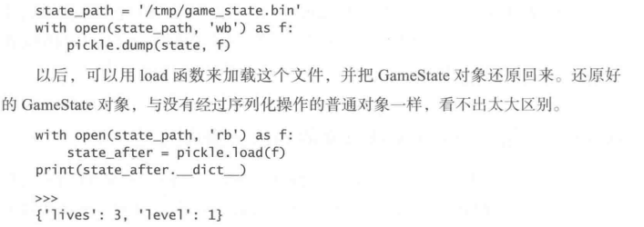

# 摘要

# 目录

# 第42条:用functools.wraps定义函数修饰器

使用@符号来修饰函数，其效果就等于先以该函数为参数，调用修饰器，然后把 修饰器所返回的结果，赋给同一个作用域中与原函数同名的那个变量。

这个机制下的副作用是会把修饰器内部的相应函数传递给模块中的同名变量。

functools.wraps可以解决这一问题，他可以把与内部函数相关的重要元数据全部复制到外围函数。

对于调试器这种依靠内省机制的工具，直接编写修饰器会引发奇怪的行为。修饰器还可能导致一些难以排查的问题。

# 第43条：考虑以contextlib和with语句来改写复用的try/finally 代码

说白了就是实现上下文管理器协定，昝略

# 第44条：用copyreg实现可靠的pickle操作

内置的pickle模块能够将Python对象序列化为字节流，也能把这些字节反序列化为 Python对象。

书中提示，用于**通信**时，pickle不安全，可能被混入恶意代码，而JSON数据安全。

pickle做的事就是把对象序列化，提供了一种保存/提取对象的方法。

 

不过这个被打包的实例所属的类改变后，这个示例再解压出来就过时了，比如会缺元素什么的。

而`copyreg`模块可以被用来控制pickle操作的行为。

==**未完**==

# 第45条：应该用datetime模块来处理本地时间，而不是用time模块

Python提供了两种时间转换方式。旧的方式，是使用内置的`time`模块，这是一种极易出错的方式。而新的方式，则是采用内置的`datetime`模块。该模块的效果非常好，它得益于Python开发者社区所构建的pytz软件包。

`time`暂时不进行记录，用时再看，`time`的缺点是无法协调各种本地时区。

`datetime`用时再看

# 第46条：使用内置算法与数据结构

数据结构集中于`collections`模块。`heapq`模块提供与堆相关的函数，可在list类型中创建堆。`bisect`提供了二分查找。

1. **双向队列**`collections.deque`

   在头部或尾部插入/删除一个元素只消耗常数级别时间，适合**先进先出**。在list的头部插入元素需要线性级别的时间。

2. **有序字典**`collections.OrderedDict`

   标准字典是无序的，在拥有相同键值对的两个dict上面迭代，可能会出现不同的迭代顺序。这是因为其快速哈希表决定的。

3. **带有默认值的字典**`collections.defaultdict`

    

   具体暂略，上面代码能实现计数器功能。***我记得好像是有专门的计数器结构的，是迭代器库那个我记混了？***

4. **堆队列(优先级队列)**`heapq`

   这里只介绍了`heappush`，它使list中可以存在堆结构，甚至在调用sort后依然可以保持。

5. **二分查找**

   `bisect.bisect_left`提供二分查找方法，返回搜寻值的插入点（搜寻的值不一定在序列中）。

# 第47条：在重视精确度的场合，应该使用decimal

提供定点数，高精度需求时应该使用它

**<u>相似的，有理数类Fraction类被包含在fractions模块中</u>**。

*<u>这种明显就是用到了再看就来得及的</u>*

# 第48条：学会安装由Python开发者社区所构建的模块

略

