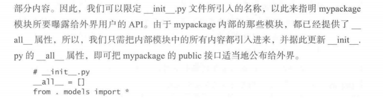

虽然短时间不会涉及协作开发，但是把代码写规范是好的。

# 第49条：为每个函数、类和模块编写文档字符串

用`__doc__`可以访问函数（类什么的也一样吧）的文档。如

 

help函数也可以用来查看文档。

这种标准的文档定义方式，使得开发者很容易就能构建出一些工具，把纯文本转换成HTML等更为友好的格式。例如，Python 开发者社区就构建了 <a href='http://sphinx-doc.org/'>Sphinx</a> 等优秀的文档生成工具。此外，还有像<a href='https://readthedocs.org/'>Read the Docs </a> 这样，由Python开发者社区协力搭建的网站，能够为开源的Python项目提供美观的文档及免费的存放空间。

<a href='http://www.python.org/dev/peps/pep-0257'>PEP 257</a> 提出了一些规范，具体如下：

- 为模块编写文档

  头一行描述模块用途，然后告知具体的用法。

   

- 为类编写文档

  一句话阐明用途，然后详述该类的操作模式。

- 为函数编写文档

  一句话阐明用途，写明参数，返回和可能抛出的异常。

  

# 第50条：用包来安排模块，并提供稳固的API

只要目录里有`__init__.py`,我们就可以采用相对于该目录的路径，来引入目录中的其他Python文件。

包所提供的能力，主要有两大用途。

## 名称空间

包的第一种用途，是把模块划分到不同的名称空间之中。这使得开发者可以编写多个文件名相同的模块，并把它们放在不同的绝对路径之下。

*<u>如果包内方法同名，则可以通过`as`语句给引入当前作用域的属性重新起名。</u>*

## 稳固的API

Python包的第二种用途，是为外部使用者提供严谨而稳固的API。我们必须把代码的内部结构对外隐藏起来，以便在不影响现有用户的前提下，通过重构来改善包内的模块。

在Python程序中，我们可以为包或模块编写名为`__all__`的特殊属性，以减少其曝露给外围API使用者的信息量。`__all__`属性的值，是一份列表，其中的每个名称，都将作为本模块的一条公共API，导出给外部代码。**<u>如果外部用户以`from foo import *`的形式来使用foo模块，那么只有`foo.__all__`中列出的那些属性，若是foo模块没有提供`__all__`,则只会引人public属性（不以双下划线开头的）。</u>**

 

 

这样只要重写`__init__`，API的使用者就可以直接从包名引入方法，而不需要访问包中具体的函数名称。

避免使用`import *`，同名覆盖的问题不得不注意

 

# 第51条：为自编的模块定义根异常，以便将调用者与API相隔离

<u>这一点是以前没怎么注意的</u>

在模块中编写一种根异常，然后令该模块所抛出的异常都继承自这个根异常。

 

首先，通过捕获根异常，调用者可以得知他们在使用你的API时，所编写的调用代码是否正确。如果调用者以合理的方式来使用这套API，那么他们应该会捕获该模块所抛出的各种异常。若是某种异常没有得到处理，那么该异常就会传播到try/except语句中负责处理模块根异常的那个except块里面，而那个except块，则会把该异常告知API的使用者，提醒他们应该为这种类型的异常添加适当的处理逻辑。

使用根异常的第二个好处，是可以帮助模块的开发者找寻API里的bug。

使用根异常的第三个好处，是便于API的后续演化。将来我们可能会在AM里面提供更为具体的异常，以便在特定的情况下抛出。

# 第52条：用适当的方式打破循环依赖关系

引入模块的时候，Python会按照深度优先的顺序执行下列操作：

 

==略==

